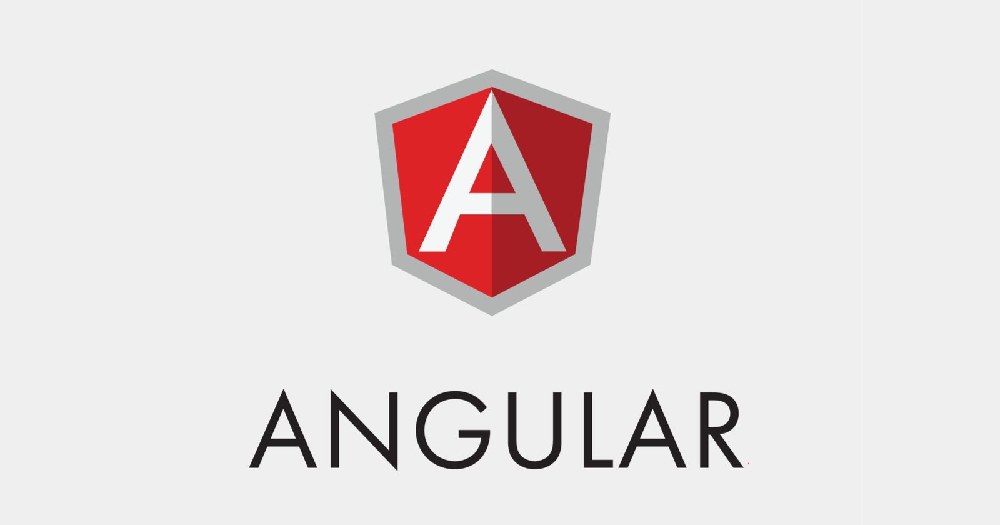

<h1 style="font-family: 'Título';">PECS (Sistema de Comunicação por Troca de Figuras)</h1>

  

# Instalação do Angular

  

Verifique se você possui o Node.js e npm instalado em seu computador, usando o seguintes comandos:

    $ node -v 
    $ npm -v

Para intalar o Node e npm caso não tenha instalado ainda:

    $ sudo apt install nodejs npm

Agora será preciso instalar o Angular CLI, usado para facilitar a criação de projetos.

    $ npm install -g @angular/cli

### Após tudo isso feito, basta executar o projeto usando o seguinte comando:

    $ ng serve

# Time de desenvolvimento

| Nome               | Função            |
| :----------------- | :---------------- |
| **Carlos Alberto** | _BackEnd/Suporte/FrontEnd_ |
| **Henrique**       | _Suporte_         |
| **Miguel Vilela**  | _BackEnd_         |
| **Alexandre**      | _Backend_         |
| **Luana**          | _BackEnd_         |
| **Ingrid**         | _BackEnd_         |
| **Wembley**        | _BackEnd_         |
| **Cauan**          | _BackEnd_         |

# Referências

- Angular - Pagina oficial do Angular [aqui](https://angular.io/)
- Node - Pagina oficial do Node [aqui](https://nodejs.org/en)
- npm - Pagina oficial do npm [aqui](https://www.npmjs.com/)

